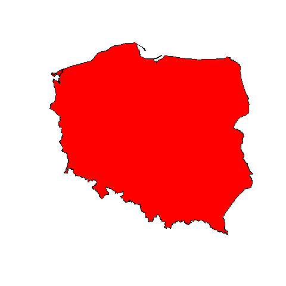

# Poland-on-maps

Nice maps of Poland created with R and Python.

## About

I always wanted to create nice maps that I've seen all over the internet. From what I know most of them are done in Python and R

## Inspiration

Main inspiration was the Twitter(X) [30 day map challenge](https://twitter.com/hashtag/30DayMapChallenge) and all the beautiful and useful maps created by many people.

Next there was [Milos](https://twitter.com/milos_agathon) that created map of river basins of Poland and provide a [YouTube tutorial](https://www.youtube.com/watch?v=fIOCVCxh2B8).

So I have place to start.

## Goals

With this project I want:
- Create beautiful and useful maps of Poland
- Learn where to find interesting data that can be presented on maps
- Learn Python and R

## Experiments

First experiment that I want to do is to write a journal about my learning process. I am using the [Obsidian](https://obsidian.md/) app.

The journal can be found here: [docs / journal](docs/journal/)

# Map ideas

List of map views that I want to create:

- [x] Poland river basins from Milos tutorial ([01 - tutorial - river basins](docs/01%20-%20tutorial%20-%20river%20basins.md))
- [x] Poland borders ([02 - Poland borders](docs/02%20-%20Poland%20borders.md))
- [ ] Poland borders with main rivers
- [ ] Poland terrain elevations
- [x] Poland regions ([2024-03-04](docs/journal/2024-03-04.md))
- [ ] Poland elections
- [ ] Poland roads
- [ ] Poland railroads
- [ ] Poland lighthouses
- [ ] Poland metro lines
- [ ] TBC ...