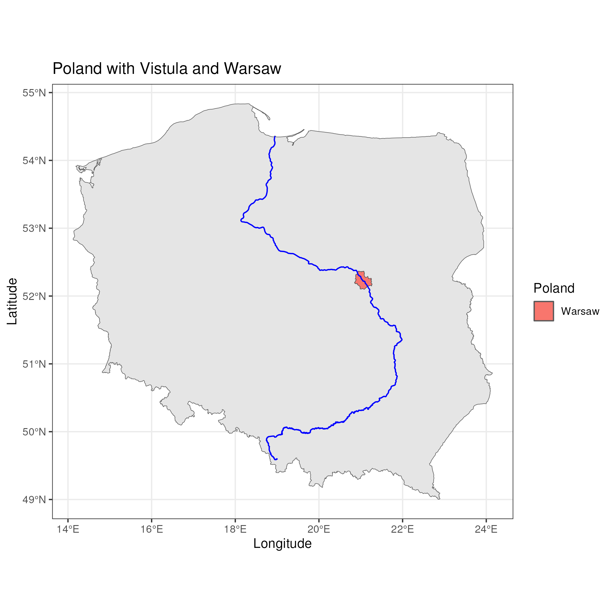
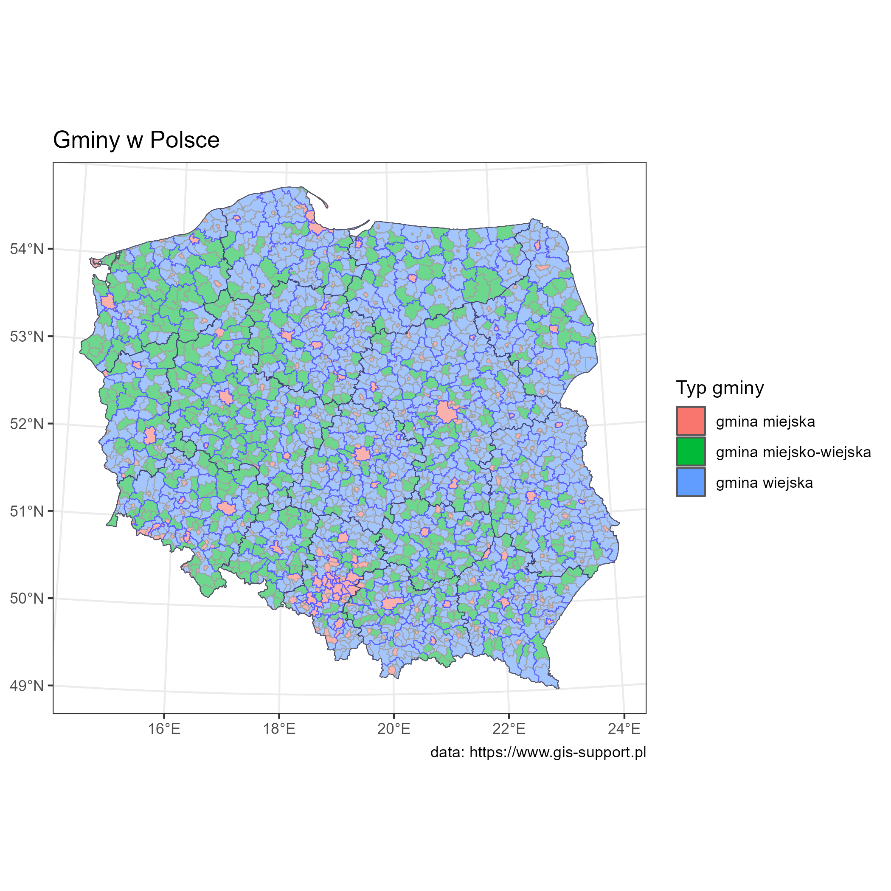

# Poland-on-maps

Nice maps of Poland created with R and Python.



## About

I always wanted to create nice maps that I've seen all over the internet. From what I know most of them are done in Python and R

## Inspiration

Main inspiration was the Twitter(X) [30 day map challenge](https://twitter.com/hashtag/30DayMapChallenge) and all the beautiful and useful maps created by many people.

Next there was [Milos](https://twitter.com/milos_agathon) that created map of river basins of Poland and provide a [YouTube tutorial](https://www.youtube.com/watch?v=fIOCVCxh2B8).

So I have place to start.

## Goals

With this project I want:
- Create beautiful and useful maps of Poland
- Learn where to find interesting data that can be presented on maps
- Learn Python and R

## Experiments

First experiment that I want to do is to write a journal about my learning process. I am using the [Obsidian](https://obsidian.md/) app.

The journal can be found here: [docs / journal](docs/journal/)

# Map ideas

List of map views that I want to create:

- [x] Poland river basins from Milos tutorial ([01 - tutorial - river basins](docs/01%20-%20tutorial%20-%20river%20basins.md))
- [x] Poland borders ([02 - Poland borders](docs/02%20-%20Poland%20borders.md))
- [x] Poland borders with main river ([04-Poland-rivers](src/04-Poland-rivers/04-Poland-rivers.R))
- [ ] Poland terrain elevations
- [x] Poland regions ([2024-03-04](docs/journal/2024-03-04.md))
- [x] Poland elections per voivodeship ([2024-03-23](docs/journal/2024-03-23.md))
- [x] Poland elections per province ([2024-03-24](docs/journal/2024-03-24.md))
- [ ] Poland roads
- [ ] Poland railroads
- [ ] Poland lighthouses
- [ ] Poland metro lines
- [x] Poland + Vistula + Warsaw ([2024-03-17](docs/journal/2024-03-17.md))
- [x] Vistula + Warsaw ([2024-03-17](docs/journal/2024-03-17.md))
- [x] Vistula + Krakow  ([2024-03-17](docs/journal/2024-03-17.md))
- [x] Map with KML track data ([2024-03-28](docs/journal/2024-03-28.md))
- [x] Poland's airports ([2024-04-05](docs/journal/2024-04-05.md))
- [x] Poland's provinces (gminy) ([2024-04-08](docs/journal/2024-04-08.md))
- [ ] TBC ...

# How to run scripts

The projects provides a Docker image that can be used to generate maps if you don't have the [R language project](docs/R%20language%20project.md) environment.

## Official "Poland on maps" Docker image

The image used in this project is quite custom (based on the [Rocker project](docs/Rocker%20project.md)) image but also extended with few R packages. It is available on the [Docker Hub](docs/Docker%20Hub.md) for you to download.

```bash
docker pull creyn/poland-on-maps:latest
```

## Docker

The image is based on the https://rocker-project.org/ image and provides different methods to interact with R.

```bash
git clone https://github.com/creyn/Poland-on-maps.git
cd Poland-on-maps
```

To build the image:
```bash
docker build -t poland-on-maps .
```

### Run RStudio

After starting the image:
```bash
docker run --rm -ti -e PASSWORD=yourpassword -p 8787:8787 poland-on-maps
```

You can open the [RStudio](docs/RStudio.md) in the browser `http://localhost:8787` with the user `rstudio` and password `yourpassword`.

### Execute scripts to create maps

You can start the image and be able to run maps scripts from bash:
```bash
docker run -it -v ${PWD}:/home/docker -w /home/docker -e POM_DATA_FOLDER=/home/docker/data -e POM_OUTPUT_MAPS_FOLDER=/home/docker/output poland-on-maps bash
```

This will mount the project folder into the container so you can use your favourite IDE to change the "R" scripts and the run the new version from the bash in container as shown below.

In bash you can run each script using the installed `Rscript` tool:
```bash
Rscript src/02-Poland-borders/02-Poland-borders.R
```
```bash
Rscript src/03-Poland-regions/03-Poland-regions.R
```

**Parameters:**

- `-i`: interactive, Keep STDIN open even if not attached
- `-t`: Allocate a pseudo-TTY
- `-v`: Bind mount a volume
- `-e`: Set environment variables

**Description:**

This command will:
- mount the current directory (on Windows) so the project folder as `/home/docker`, so all scripts and files will be available in `bash `
- set `/home/docker` as current working directory so you don't have to `cd` into it
- set optional `POM_DATA_FOLDER` for scripts to save downloaded dataset files (those can be big files) in the mounted folder `data` suf-folder - if not set, the default would be each script `script-big-data` sub-folder
- set optional `POM_OUTPUT_MAPS_FOLDER` for scripts to save output final maps in the mounted folder `output` sub-folder - if not set, the default would be each script folder
- starts `bash` so you can start typing

# Discovered interesting GIS datasets


