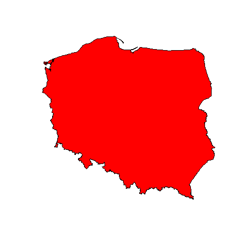

code: [02-Poland-borders](../src/02-Poland-borders/02-Poland-borders.R)

This line plots border:

```r
plot(sf::st_geometry(country_sf), col = "red")
```

I need to trace back those geometry and sf parameters.

The `country-sf` comes from the `giscoR` package:

```r
country_sf <- giscoR::gisco_get_countries(  
    country = "PL",  
    resolution = "1"  
)
```

This [giscoR](giscoR.md) looks like something worth investigating. 

Running the code from [PyCharm IDE](PyCharm%20IDE.md) plots it on the IDE window, but using [Rscript](Rscript.md) the plot device is not shown.

We can use explicit image device and then close it (but in this way it won't be shown in the PyCharm window):
```r
png('src/02-Poland-borders/02-Poland-borders.png')
plot...
dev.off()
```

There is also difference in the `working directory` path (Rscript sets it as script folder while PyCharm as main project location).

We can use the `here` package that finds root folder of the script / project.

```r
install.packages("here", repos='http://cran.us.r-project.org')  
setwd(here::here())
```

The final map looks like this:
