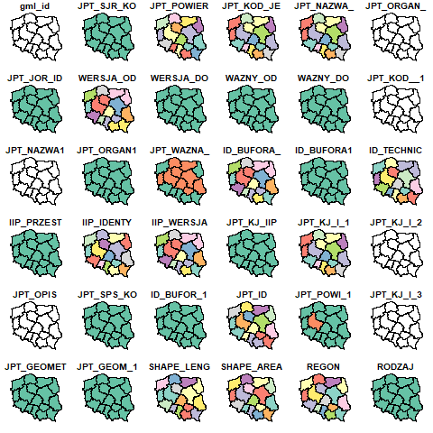

Now it is time to map Poland regions (provinces).

I was able to find nice data source here: [GIS Support PL](https://gis-support.pl/baza-wiedzy-2/dane-do-pobrania/granice-administracyjne/)

There is quite a lot of published data and I am interested in "Województwa" dataset.

The code is here: [03-Poland-regions](../../src/03-Poland-regions/03-Poland-regions.R)

The `shp` file has only 7 MB and it contains 36 attributes (view on that dataset):

And the final map of polish regions (provinces) looks like this:

Please notice that in that dataset the Hel peninsula is missing. Looks weird but that is the data.
