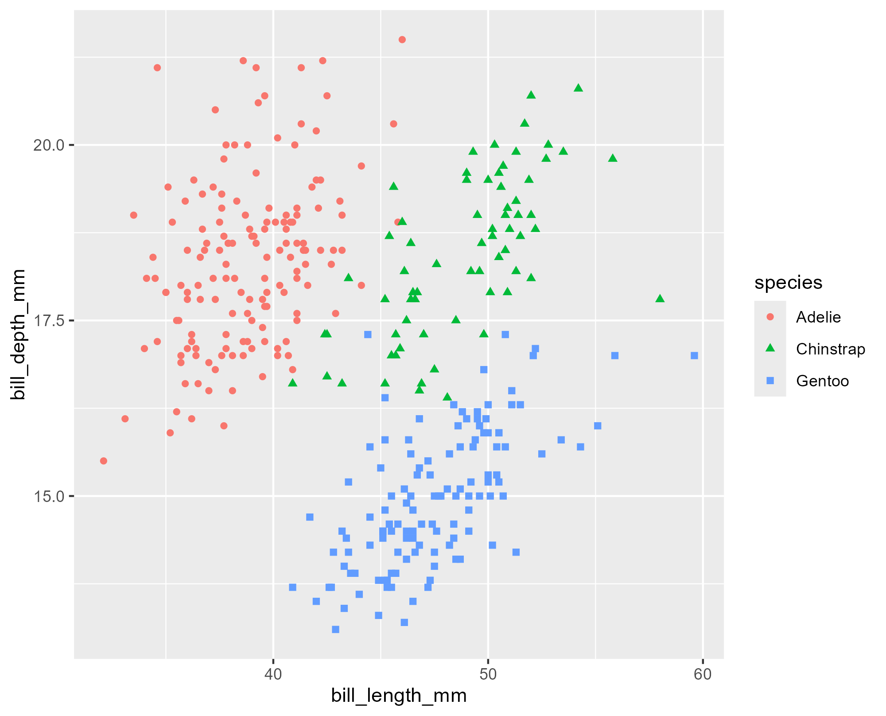

[[2024-03-13]] | [[2024-03-15]]
#journal

---
**Thursday**

Another day of learning visualisation in [Tidyverse](../Tidyverse.md) from the [R for Data Science](../R%20for%20Data%20Science.md) book.

A little more about visualization of relations and how to save a plot to a file.

They also recommend [Quarto](../Quarto.md) for producing the final reports. But this is later in the book.

And there is an image saved to disk using `ggsave`:

