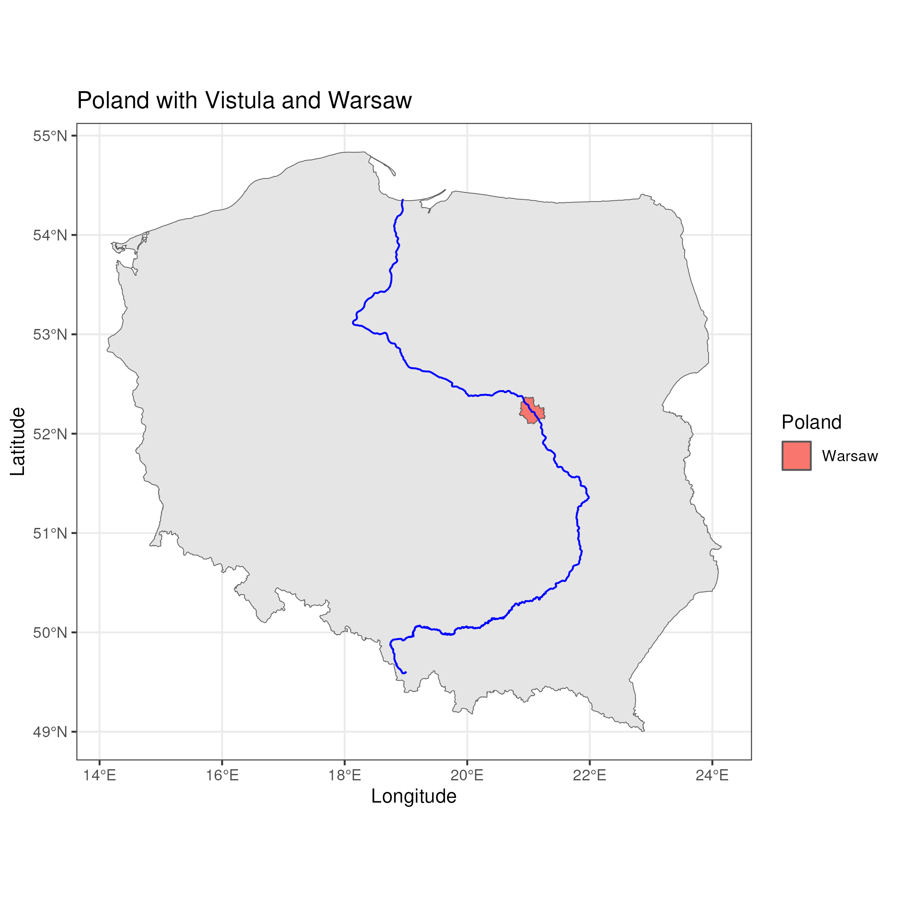
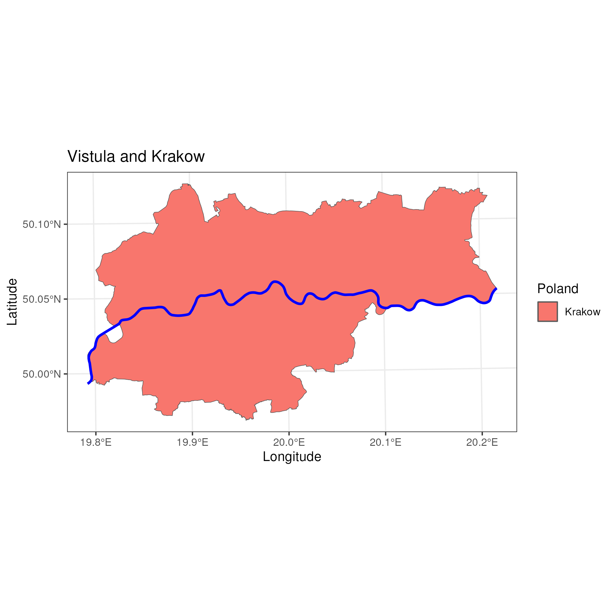

[[2024-03-16]] | [[2024-03-18]]
#journal [README](../../README.md)

---
**Sunday**

Next map I want to have is: Poland with borders, Vistula river and Warsaw capitol city.

To draw city I could use geometry from SHP file but I want to add just simple coordinate point.

To draw a point we have to know the latitude and longitude of a city and use `data.frame` with such columns and convert it to [Simple Features - SF](../Simple%20Features%20-%20SF.md) using the `st_as_sf` with proper [CRS](../CRS.md):

```r
points <- data.frame(lon = c(21.017532), lat = c(52.237049))  
points$NAME <- c("Warsaw") # this adds column for legend
cities <- st_as_sf(x = points, coords = c("lon", "lat"), crs = 4326)
```

The final map:


That dot for Warsaw looks ok-ish. So let me try with Warsaw borders.

Dataset comes from [GIS Support PL](../GIS%20Support%20PL.md).

The final map:



Looks much better now :)

Plus using the `st_bbox` and `st_crop` we could limit the area we want to focus on. Assuming both have the same [CRS](../CRS.md):

```r
warsaw_region <- st_transform(warsaw_region, st_crs(vistula))
warsaw_box <- st_bbox(warsaw_region)  
vistula_boxed <- st_crop(vistula, warsaw_box)
```

And this is how the Vistula river looks in the Warsaw and Krakow areas:



## Interesting

To read file in UTF8:
```r
rivers <- st_read(filename, options = "ENCODING=UTF8")
```

How to use maps in R:
```r
# interactive map:
library(mapview)
mapview(my.sf.point)

# convert to sp object if needed
my.sp.point <- as(my.sf.point, "Spatial")
```

