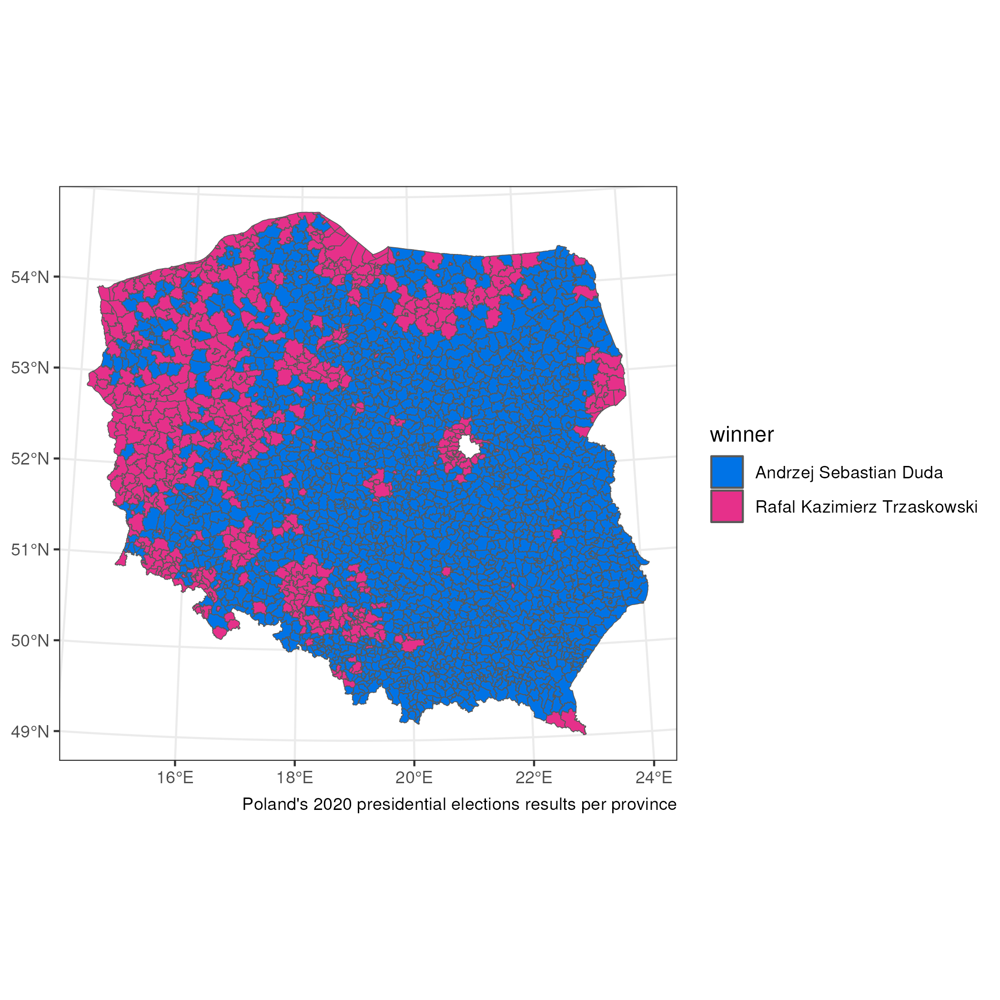

[[2024-03-23]] | [[2024-03-25]]
#journal [README](../../README.md)

---
**Sunday**

Today I want to create a map with the results of polish presidential elections in 2020 per provinces (I don't know how to translate this properly, in polish it is `gmina`).

Shapes: [GIS Support PL](../GIS%20Support%20PL.md)
Results: [Panstwowa Komisja Wyborcza](../Panstwowa%20Komisja%20Wyborcza.md)

The final map looks like this:

Please take a look at the capitol city Warsaw. Clearly both datasets have different granularity of provinces. 