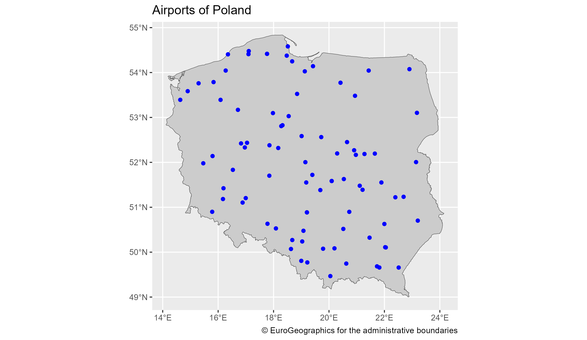

[[2024-04-04]] | [[2024-04-06]]
#journal [README](../../README.md)

---
**Friday**

Let's add some useful code to my new package.

After creating new R package project you have to put some code in the "R" folder.

The `src/packages/POMUtils/R/hello.R` file:
```r
hello <- function(name = "your name") {  
    name <- stringr::str_to_title(name)  
    print(paste("Hello,", name))  
}
```

The `hello` function now needs to be exported in the `NAMESPACE` file:
```r
export("hello")
```

The you have to run the `R.exe` console and go to the package folder and then run:
```r
> library(devtools)
> build()
── R CMD build ─────────────────────────────────────────────────────────────────────────────────────────────────────────
✔  checking for file 'C:\_projects\Poland-on-maps\src\packages\POMUtils/DESCRIPTION' (438ms)
─  preparing 'POMUtils':
✔  checking DESCRIPTION meta-information ...
─  installing the package to process help pages
─  saving partial Rd database (2.8s)
─  checking for LF line-endings in source and make files and shell scripts
─  checking for empty or unneeded directories
─  building 'POMUtils_1.0.tar.gz'

[1] "C:/_projects/Poland-on-maps/src/packages/POMUtils_1.0.tar.gz"
```

The package is created 😊

To use it in the script:
```r
install.packages("src/packages/POMUtils_1.0.tar.gz")
POMUtils::hello('test')
```

Now I can create a real utils package for my scripts.

It looks like I can do setup of the script.

A first map created using the new package is the map of airports of Poland from the [giscoR](../giscoR.md) dataset.


