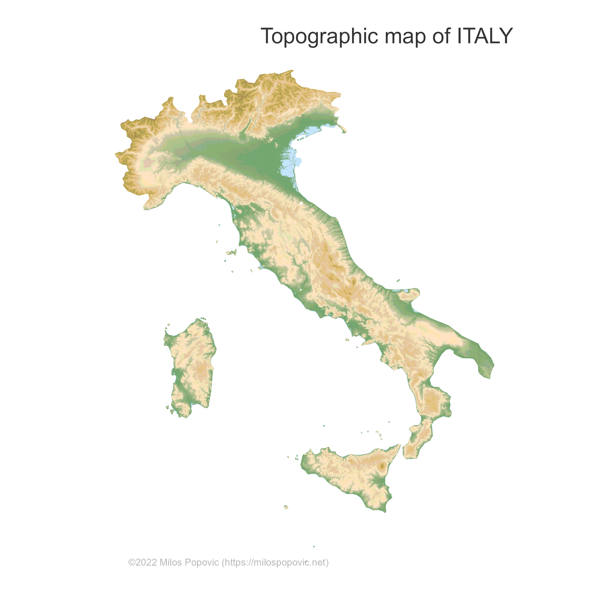
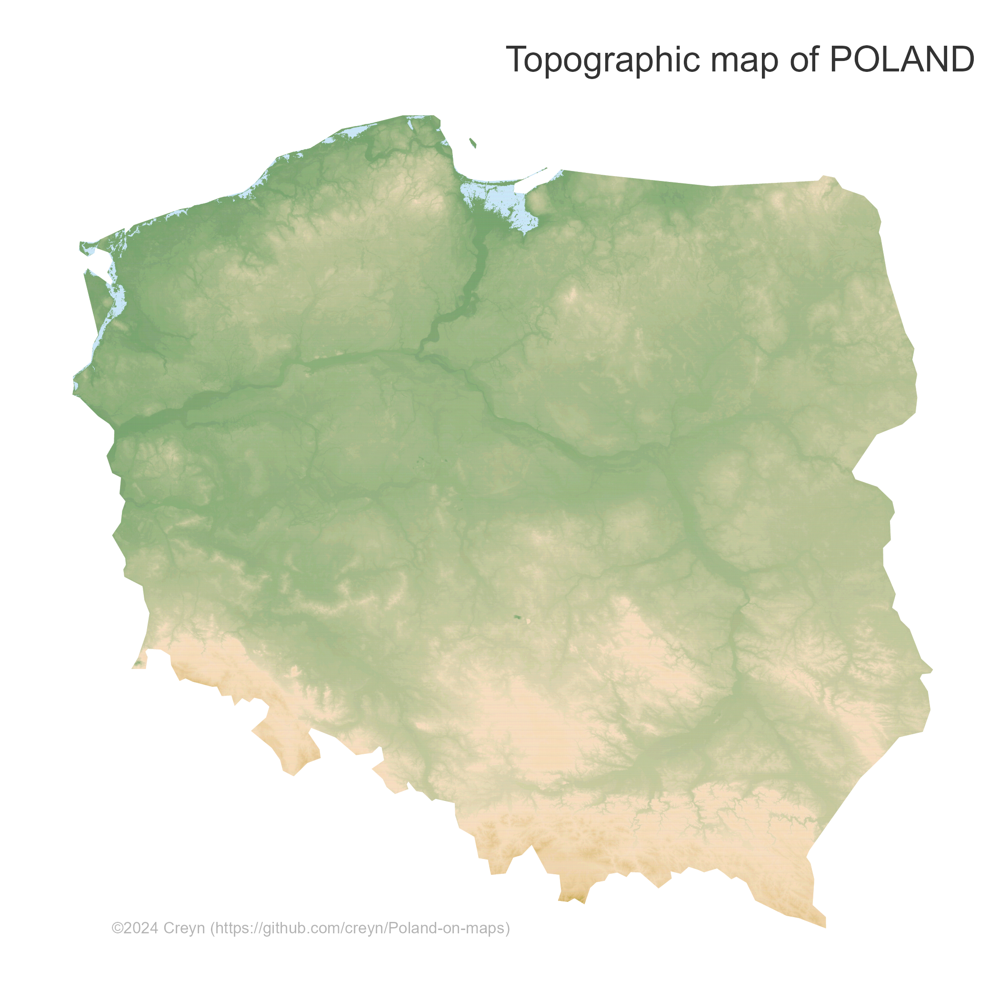

[2024-04-11](2024-04-11.md) | [2024-04-13](2024-04-13.md)
#journal [README](../../README.md)

---
**Friday**

After fun with election result map, now a little detour for topographic maps from [Milos](../Milos.md).

There is a nice tutorial here: [How to create a crisp topographic map in R](../inbox/How%20to%20create%20a%20crisp%20topographic%20map%20in%20R.md). Let's follow it.

He also mentioned some nice project with satelite imagery:
- [[Copernicus Land Monitoring Service]]
- [[NASA Earthdata search]]
- [[USGS Earth explorer]]

This is the map from the tutorial (with lowered resolution and size):

And when changing the country to Poland:

