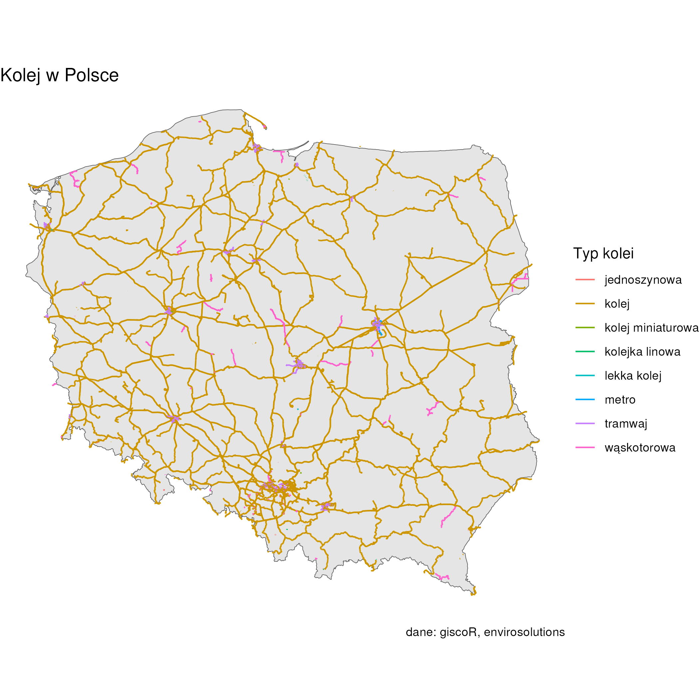
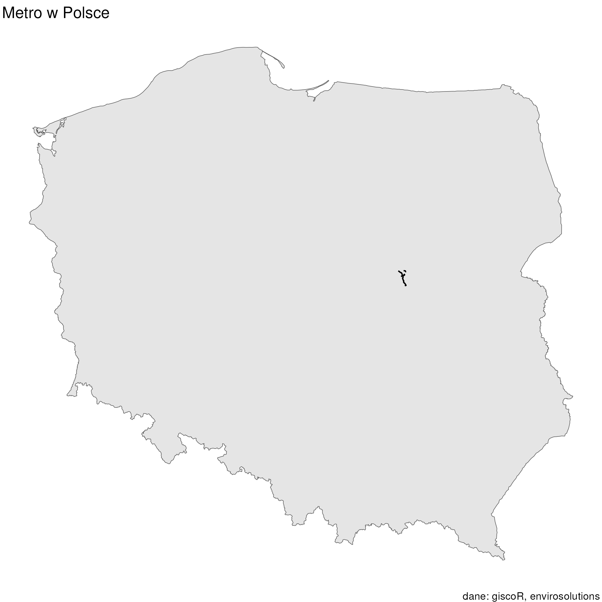

[2024-05-15](2024-05-15.md) | [2024-05-17](2024-05-17.md)
#journal [README](../../README.md)

---
**Thursday**

Another dataset: [EnviroSolutions - drogiKolejowePL](../EnviroSolutions%20-%20drogiKolejowePL.md)

Map:

Plus if we take a look at each `fclass` individually we could notice interesting things:

I could use this dataset to create map of **subway** in Poland as I planned. Nice 😊

